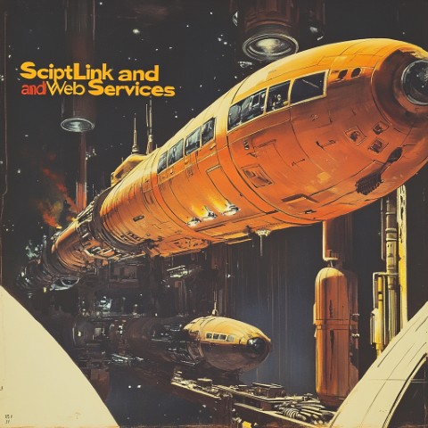

<!-- u240613 -->

  

# What is this place?

This repository contains information, documentation, and additional resources about:

* ScriptLink and web services
* Creating a custom web service for Avatar
* Self-hosting custom web services
* Third-party components
* ...and more!

## Who is putting all this cool stuff together?

* [Chris Banwarth](https://github.com/APrettyCoolProgram)  
  Application Integration Architect at [Spectrum Health Systems](https://www.spectrumhealthsystems.org/)

* [Chris M.](URL)

# What's here?

Not much, more soon.

For now, check out this video series that covers creating your own Avatar custom web service using .NET Core:

https://www.youtube.com/playlist?list=PL8ACjh0tRO8OK4bRnwSe0vq5eOQ0fYd2u